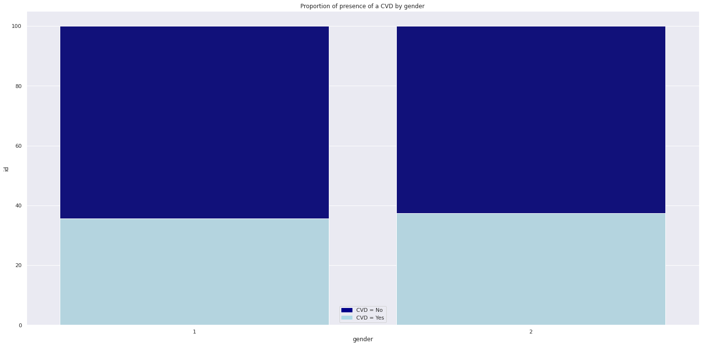

# Cardio Catch Disease

*This is a classification project that creates a model to predict if someone has a cardiovascular disease.*

#### This project was made by Lara de Almeida.

# 1. Business Problem.
Cardio Catch Diseases is a company specialized in detecting heart disease in the early stages. Its business model lies in offering an early diagnosis of cardiovascular disease for a certain price.

Currently, the diagnosis of cardiovascular disease is manually made by a team of specialists. The current accuracy of the diagnosis varies between 55% and 65%, due to the complexity of the diagnosis and also the fatigue of the team who take turns to minimize the risks. The cost of each diagnosis, including the devices and the payroll of the analysts, is around $1,000.00.

The price of the diagnosis, paid by the client, varies according to the precision achieved by the team of specialists.

| Exam Accuracy | Price          | Rules                                    | Example                         |
|:--------------|:---------------|:-----------------------------------------|:--------------------------------|
| Above 50%     | min \$500\.00  | \+\$500 for each additional 5% precision | Accuracy = 55% \-> \$1,000\.00 |
| Up to 50%     | $0\.00         | N/A                                      | N/A                             |

Thus, we see that **different values in the exam accuracy**, given by the team of specialists, make the company either have a profitable operation, revenue greater than the cost, or an operation with a loss, revenue less than the cost. This instability of the diagnosis makes the company to have an **unpredictable cashflow**. 

# 2. Business Assumptions.
According to the World Health Organization (WHO), an estimated 17.9 million died from CVDs in 2019. This represented 32% of all global deaths. Of these deaths, 85% were due to heart attack and stroke.</

It is important to detect cardiovascular diseases as early as possible so that treatment with counselling and management can begin. 

There are important behavioural risks factors that can lead to a heart diesase and stroke, such as unhealthy diet, physical inactivity, tobacco usage and harmful use of alcohol. The effects of these behaviours can show up in individuals as raised blood pressure, raised bloo glucose, raised blood lipids, overweight and obesity.

There are other risk factors, as brought up by the National Health Service from UK, like:
 - age (CVD are most common in people over 50 and the risk of developing increases as you get older
 - gender (men are more likely to develop a CVD in an early age than woman)
 
 Cardio Catch Diseases gathered data from all of its customers, including if they develop or not a CVD afterall. The dataset includes the following features: 
 
|               Feature               | Type of Input |                          Units                         |
|:-----------------------------------:|:-------------:|:------------------------------------------------------:|
|                 Age                 |   Objective   |                          days                          |
|                Height               |   Objective   |                       centimeters                      |
|                Weight               |   Objective   |                        kilograms                       |
|                Gender               |   Objective   |                  1 if woman, 2 if men                  |
|       Systolic blood pressure       |  Examination  |                          mmHg                          |
|       Diastolic blood pressure      |  Examination  |                          mmHg                          |
|             Cholesterol             |  Examination  | 1 if normal, 2 if above normal, 3 if well above normal |
|               Glucose               |  Examination  | 1 if normal, 2 if above normal, 3 if well above normal |
|               Smoking               |   Subjective  |                      binary (0,1)                      |
|            Alcohol intake           |   Subjective  |                      binary (0,1)                      |
|          Physical activity          |   Subjective  |                      binary (0,1)                      |
| (target) Presence or absence of CDV |   Subjective  |                      binary (0,1)                      |
 
 The objective features are factual information. The examination features are results of medical examinations and the subjective ones are information given by the patient.
 
 For the final solution, I considered that the examination features (categorical data) are constructed on tabulated data from health organisations, with no bias of a single medical opinion. 
 I also assumed that the patient did not lie when providing the subjective data.
  
# 3. Solution Strategy

My strategy to solve this challenge was: (SEGUIR JUPYTER NOTEBOOK, resumo breve do que foi feito)

**Step 01. Data Description:** 
At this step, the main goal was to understand the data, getting information such as data types, data dimensions and presence of missing values.

With descriptive statistics, I checked the distribution of each feature, and also the existence of outliers.

There were outliers in height, weight and both blood pressures. For the first moment, I dropped the outliers, which represented around 14,6% of the dataset, taking the risk of losing information.

To finish this step, I compared the distribution of some features by gender because there were more women in the datased and I wanted to see if the distribution of the other features would follow the same unbalance proportion.

**Step 02. Feature Engineering:**
The main goal here was to derive new attributes based on the original variables to better describe the phenomenon that will be modeled.

For that, I used a mindmap to brainstorm ideas of the causes and risky factors to CVDs, using the previous research I made in trusted websites like WHO and NHK.

Then, I came up with 10 hypothesis about my dataset, that involved lifestyle (phisical activity, tobacco usage and alcohol intake), other diseases and conditions (obesity, diabetes, hyperlipidemia and hypertension)

The only feature I could surely derive from my data was the body mass index (bmi), using height and weight, and maybe create a feature with the bmi classification according the WHO (but both would bring the same info to my model).

I could not assume that people with hight blood pressures were hypertensive, or people with well above levels of cholesterol and glucose were hyperlipidemics or dibetics because I was not sure if those were punctual or lasting symptoms.

**Step 05. Exploratory Data Analysis:**
Exploratory Data Analysis is used to analyze and investigate a dataset to summarize their main characteristics and to come up with insight that might be helpful to the business.

I did this step using visualization tools and dividing my analysis in three parts:
- At the first one, I plotted the distribution of all features, to make a double check of how they behave;
- On the second one, I used the dataset to validate or not the hypothesis I created on the previous step of the project, always comparing one or two features with the target;
- To finish, I calculated the pearsons correlation of the numerical variables, and the cramer-v correlation between categorical data, and the correlation-ratio between numerical and categorical ones. I used a library (Dython) to make most of these calculations.

**Step 06. Data Preparation:**
Before any further transformation, I splited my data into train and test subsets. I did the split at this moment to avoid any data leakage to my model. 

Then I applied the MinMaxScaler to normalize the numerical features. I chose the MinMaxScaler because because I had non gaussian distribution of features and also because I droped all the outliers at the data description step.

**Step 06. Feature Selection:**
Because of Occams Razor, I did a feature selection step to choose the features that would explain best the phenomenon. 

For that I used two approaches: first, I applied a random classifier (I chose Random Forest). Then, I used the feature importances function to get the which features most influenced the model. I got an graph with the importance of each one to choose manually the ones I considered the best.

Then I also applied the Boruta's Feature Selector, which is an algorithm tha creates a new dataset with shadow features, mixing the values of these and applying a classification algorithm to get the importance of shadow and original features. Then, it compares the importance of the original with the shadow features to return which ones must be chosen. After some iterations, Boruta uses the p-value of the importance feature's table to select the most important features. 

For this project, Boruta selected three features, which were the most important ones according to the manual importance of features graph too. They were: age, bmi and systolic blood pressure (ap_hi).

**Step 07. Machine Learning Modelling:**
I chose six machine learning models to test and compare results. 

I trained all of them and then I compared accuracy and recall metrics to choose the best one. 
Accuracy was the chosen metric because it is what determine the income of Cardio Catch Diseases. Althought, is good to look at recall metrics as well because a sick person misdiagnosed as healthy could cause trouble with lawsuits that can costs a lot to the company.

To check the real metrics, I also used a K-fold cross validation method. 

**Step 08. Hyperparameter Fine Tunning:**
The Hyperparameter Fine Tunning is an important step to ensure we are using the best parameters to train our model. 

There are many methods to do this step, but I chose to do a random search, pre-establishing some parameters and doing a loop for to train my model with all combinations to get the one that performed better.

**Step 09. Convert Model Performance to Business Values:**
If the price of diagnosis increases $500.00 every time the accuracy of the model increases 5%, it is possible to estimate the income based on the final accuracy of the chosen model. 

**Step 10. Deploy Model to Production:**
The plan is to develop a streamlit app where both analysts can include a dataset of patients to get a prediction or a person can fill a form to predict the probability of having a cardiovascular disease. 

# 4. Top 3 Data Insights

**Hypothesis 02:**
Men under 50 should be more lihely to have a CVD than women

**True.**
Men under 50 are slightly more likely to have a CVD than women 

**Hypothesis 08:**
Non active / sedentary people are more likely to have a CVD

**False.**
Active people are more likely to have a CVD.

**Hypothesis 09:** Smokers should be more likely to have a CVD.

**False.** Non smokers are slightly more likely to have a CVD

# 5. Machine Learning Model Applied
The ML models applied were:

- Logistic regression
- Random Forest
- Gradient Boosting
- Knn Classifier
- SVC
- XGBoost Classifier

Here are the results: 

|               model |          accuracy |       precision_1 |          recall_1 |
|--------------------:|------------------:|------------------:|------------------:|
|   gradient boosting |  0.7278 +/- 0.004 | 0.7433 +/- 0.0056 | 0.6854 +/- 0.0057 |
|             svm-svc | 0.7255 +/- 0.0031 | 0.7634 +/- 0.0044 | 0.6437 +/- 0.0067 |
|             xgboost |  0.7252 +/- 0.001 | 0.7442 +/- 0.0035 | 0.6757 +/- 0.0059 |
| logistic regression | 0.7219 +/- 0.0052 | 0.7503 +/- 0.0061 |  0.6545 +/- 0.008 |
|       random forest | 0.7082 +/- 0.0036 | 0.7105 +/- 0.0047 | 0.6902 +/- 0.0085 |
|                 knn | 0.6895 +/- 0.0021 |  0.6895 +/- 0.002 | 0.6754 +/- 0.0083 |

The model that performed better after cross validation was the Gradient Boosting, and it was the chosen one to go on.

# 6. Machine Learning Model Performance
After choose a model, a step of hyperparameter fine-tunning was made, using a Random Search approach. 
Finally we got to the final model performance:

|         model                 |          accuracy |       precision_1 |          recall_1 |
|------------------------------:|------------------:|------------------:|------------------:|
|   gradient boosting tunned    |  0.7281 +/- 0.004 | 0.7438 +/- 0.0055 | 0.6854 +/- 0.0048 |

# 7. Business Results
Converting this values to business language, this means that, with this model, CCD can precify their services with a minimum of $ 2,280.00.
On the best scenario, considering a baseline of 70,000 customers, CCD could have a **profit** of k$ 92.5 on the best scenario or k$ 86,9 on the worst scenario. 

# 8. Conclusions
Sometimes, simple models can bring great benefits for an organization.  
However, any machine larning model is limited by the data. This was a very simple dataset with just a few features. Some of the data were subjective and others were not very clear. 

# 9. Lessons Learned
This project was great to improve my python coding skills and to learn a bit about classification metrics, encodings and transformations. 

# 10. Next Steps to Improve
Next steps to improve the model are to make new considerations about the examination data, creating new features and to treat outliers instead of dropping them. 
I can also test other models to check if there is any improvement of the performance. 
To finish, my final recomendation after all those improvements would be other manners to collect data to train our models. 

# All Rights Reserved - Comunidade DS 2021
